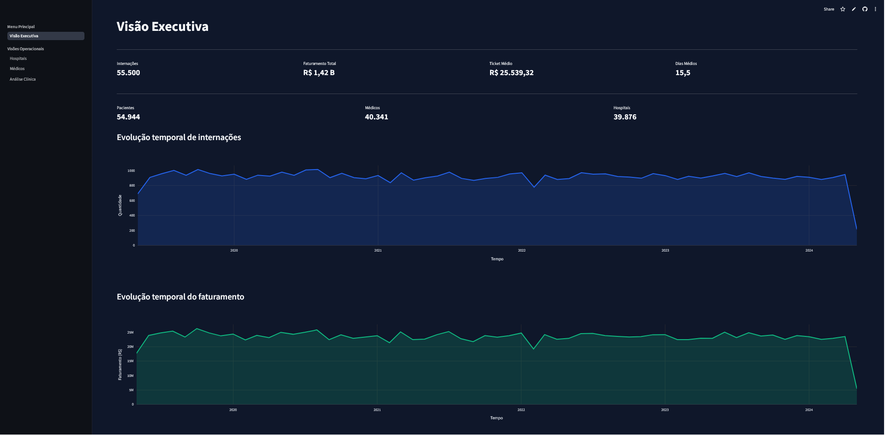

# 🏥 Hospital Data Platform




> Plataforma de dados desenvolvida para simular um ambiente corporativo hospitalar utilizando Engenharia de Dados, Analytics Engineering e Business Intelligence.
> O projeto implementa uma arquitetura moderna em camadas (Bronze → Silver → Gold), transformando dados brutos em informações analíticas confiáveis através de dbt, Snowflake e Streamlit.

## 🔄 Funcionalidades e Melhorias

O projeto foi desenvolvido com as seguintes funcionalidades:

* [x] Ingestão de dados utilizando dbt Seeds;
* [x] Arquitetura de dados em camadas Bronze, Silver e Gold;
* [x] Tratamento e padronização de dados hospitalares;
* [x] Remoção de duplicidades e tratamento de valores nulos;
* [x] Aplicação de regras de negócio utilizando SQL e dbt;
* [x] Construção de modelos analíticos para tomada de decisão;
* [x] Testes de qualidade e consistência dos dados;
* [x] Armazenamento e processamento em Snowflake;
* [x] Dashboards interativos desenvolvidos em Streamlit;
* [x] Versionamento completo utilizando Git e GitHub.

## 💻 Pré-requisitos

Antes de começar, verifique se você atendeu aos seguintes requisitos:

* Python 3.10+
* dbt Core
* Conta Snowflake
* Git instalado
* Visual Studio Code (opcional)

## 🏗️ Arquitetura do Projeto

### 🥉 Bronze Layer

Camada responsável pelo armazenamento dos dados brutos recebidos das fontes de origem.

Principais características:

* Dados sem tratamento;
* Preservação da informação original;
* Histórico completo dos registros;
* Base para as próximas etapas do pipeline.

### 🥈 Silver Layer

Camada responsável pela limpeza, padronização e enriquecimento dos dados.

Principais atividades:

* Limpeza de dados;
* Remoção de duplicidades;
* Padronização de formatos;
* Tratamento de valores nulos;
* Aplicação de regras de negócio.

### 🥇 Gold Layer

Camada analítica destinada ao consumo por dashboards e relatórios.

Principais entregas:

* Indicadores de negócio;
* Métricas consolidadas;
* Visões analíticas;
* Dados prontos para BI.

## ⚙️ Tecnologias Utilizadas

### Engenharia de Dados

* Snowflake
* dbt Core
* SQL

### Visualização de Dados

* Streamlit
* Plotly

### Desenvolvimento

* Python
* Git
* GitHub
* Visual Studio Code

## 📁 Estrutura do Projeto

```text
## 📁 Estrutura do Projeto

```text
hospital_data_platform/
│
├── .devcontainer/
│
├── analyses/
│
├── dashboard/
│   ├── .streamlit/
│   │   └── config.toml
│   │
│   ├── src/
│   │   ├── components/
│   │   │   ├── filters.py
│   │   │   └── kpi.py
│   │   │
│   │   ├── pages/
│   │   │   ├── 1_Visao_Executiva.py
│   │   │   ├── 2_Hospitais.py
│   │   │   ├── 3_Medicos.py
│   │   │   ├── 4_Clinico.py
│   │   │   └── formatters.py
│   │   │
│   │   └── utils/
│   │       ├── __init__.py
│   │       ├── database.py
│   │       └── formatters.py
│   │
│   ├── __init__.py
│   └── main.py
│
├── macros/
│   ├── categorizar_grupo_idade.sql
│   └── gerar_nome_schema.sql
│
├── models/
│   ├── camada_bronze/
│   ├── camada_prata/
│   └── camada_ouro/
│
├── seeds/
│
├── snapshots/
│
├── tests/
│   └── valida_datas_internacao.sql
│
├── dbt_project.yml
├── README.md
└── .gitignore
```


## 🚀 Como Executar

### Clonar o Repositório

```bash
git clone https://github.com/Kelvin1337/Hospital_data_platform.git
```

### Acessar o Projeto

```bash
cd Hospital_data_platform
```

### Carregar os Seeds

```bash
dbt seed
```

### Executar os Modelos

```bash
dbt run
```

### Executar os Testes

```bash
dbt test
```

### Gerar Documentação

```bash
dbt docs generate
dbt docs serve
```

## 📊 Dashboard

O projeto disponibiliza dashboards interativos para acompanhamento de indicadores hospitalares, permitindo análises executivas, operacionais e de qualidade dos dados.

Principais módulos:

* Visão Executiva
* Hospitais
* Médicos
* Indicadores Clínicos
* Qualidade dos Dados

## 🔮 Próximas Melhorias

* [ ] Pipeline CI/CD com GitHub Actions;
* [ ] Monitoramento e observabilidade dos pipelines;
* [ ] Testes automatizados adicionais no dbt.

## 😄 Seja um dos contribuidores

Quer contribuir com o projeto?

Faça um fork do repositório, implemente melhorias e envie um Pull Request.

## 👨‍💻 Autor

**Kelvin Silva**

Engenheiro de Dados com foco em Engenharia de Dados, Analytics Engineering, Cloud Computing e soluções modernas para plataformas de dados.

GitHub:
https://github.com/Kelvin1337

LinkedIn:
https://www.linkedin.com/in/kelvin-da-silva-s-866061211/
